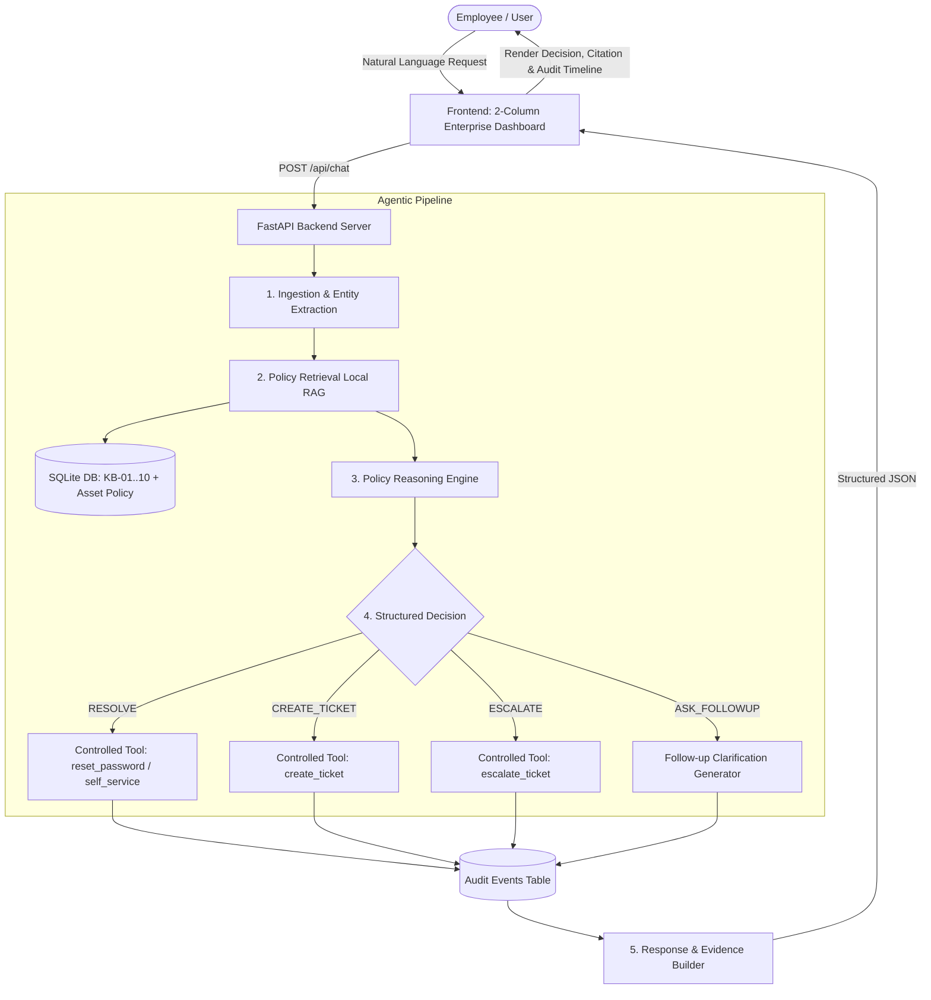

# Veridian IT Agent — Autonomous Internal IT Support Copilot

> **AIONOS Agentic AI Factory — Assignment 2: Internal Service Agent (IT Support)**  
> **Operational Scope**: Veridian Corp — Week of Monday, 21 September 2026 – Friday, 25 September 2026.  
> **Grounding Standard**: 100% strictly grounded in the official Veridian Data Pack (KB-01 to KB-10 and Finance Asset Management Policy Extract) with **zero hallucination**.

---

## 1. Project Overview
The **Veridian IT Agent** is an autonomous, policy-aware internal IT support agent designed to handle employee inquiries with strict corporate compliance. Rather than acting as an unrestricted chatbot, the system executes an agentic pipeline:
$$\text{Understand Request} \longrightarrow \text{Retrieve Grounded Policy} \longrightarrow \text{Reason over Rules} \longrightarrow \text{Act / Escalate via Controlled Tools} \longrightarrow \text{Immutable Audit Trail}$$

It resolves routine Tier-1 requests automatically, enforces manager approval workflows for contractors, pauses and escalates non-catalog software reviews to IT Security, and immediately intercepts critical security risks (e.g. employee forwarding a phishing email).

---

## 2. Problem Statement
Internal enterprise IT helpdesks face recurring operational bottlenecks:
- **Repetitive Tier-1 Volume**: Hundreds of mundane requests (password resets, guest Wi-Fi passes, VPN renewals) exhaust IT engineer time.
- **Compliance & Security Violations**: Employees forwarding phishing emails to teammates or requesting unauthorized server admin access without business justification.
- **Policy Reconciliation Clashes**: Conflicts between department policies (e.g. IT 3-year laptop replacement under KB-03 vs Finance 4-year refresh cycle under the Asset Management Policy).
- **Communication Churn**: Vague queries (e.g. *"hey can you help, its not working"*) typically trigger multiple rounds of email back-and-forth.

---

## 3. Core Features
- **100% Policy Grounded (Zero Hallucination)**: Answers are strictly derived from verified SQLite knowledge base tables storing KB-01 through KB-10 and the Finance Asset Management Policy Extract.
- **Controlled Tool Execution**: Whitelisted tools (`reset_password`, `create_ticket`, `escalate_ticket`, `get_request_context`) validated by backend handlers. The AI agent cannot execute arbitrary SQL, shell commands, or network calls.
- **Ambiguity Clarification Protocol**: Automatically detects underspecified requests and requests diagnostic details without hallucinating solutions.
- **Security Hazard Containment**: Instantly intercepts phishing or unauthorized access attempts with P1 containment alerts.
- **2-Column Enterprise Dashboard**: Interactive support chat with 1-click test scenarios on the left; real-time transparent decision, source citations, and audit timeline on the right.
- **Complete Reviewer Audit Package**: Real-time event log with 1-click JSON and Markdown export.

---

## 4. System Architecture



---

## 5. Agent Workflow Pipeline
Every employee interaction follows 5 strictly audited stages:
1. **`INGESTION` / `REQUEST_RECEIVED`**: Ingests the query, extracts entities (failed attempts, device age, remote work days).
2. **`RETRIEVAL` / `POLICY_RETRIEVED`**: Performs multi-signal retrieval over local SQLite policy records.
3. **`REASONING` / `DECISION_MADE`**: Evaluates request against retrieved policy constraints and historical ticket precedents (TK-1042..TK-1051). Categorizes into `RESOLVE`, `ASK_FOLLOWUP`, `CREATE_TICKET`, or `ESCALATE`.
4. **`EXECUTION` / `ACTION_EXECUTED`**: Invokes the whitelisted controlled tool if preconditions are met.
5. **`COMPLETION` / `RESPONSE_GENERATED`**: Assembles the policy-grounded employee response with source citation and timestamped audit record.

---

## 6. RAG Approach & Policy Grounding
- **Local Multi-Signal Retrieval**:
  - Exact Policy ID hit ($+50.0$ score weight).
  - Keyword token hit ($+15.0$ score weight).
  - Title token overlap ($+8.0$ score weight).
  - Domain rule mapping (passwords $\rightarrow$ KB-01, VPN $\rightarrow$ KB-02, laptops $\rightarrow$ KB-03, phishing $\rightarrow$ KB-09).
- **Zero Hallucination Guarantee**: If an inquiry falls outside the 10 supplied policies, the agent prompts for clarification rather than fabricating an answer.

---

## 7. Tool Architecture & Security Guardrails
The agent is decoupled from the host operating system and database execution layers:

| Controlled Tool | Functionality | Precondition / Validation |
| :--- | :--- | :--- |
| `reset_password(employee, lockout_verified)` | Manually unlocks account and queues reset link | Verified $>5$ failed attempts per KB-01 |
| `create_ticket(employee, category, ...)` | Creates structured ticket in SQLite | Validated category and priority |
| `escalate_ticket(ticket_id, reason, dept)` | Updates ticket status to escalated | Direct routing to Security or Finance |
| `get_request_context(employee_name)` | Safe read-only context lookup | Read-only parameterized query |

---

## 8. API Endpoints

| Method | Endpoint | Description |
| :--- | :--- | :--- |
| `GET` | `/health` | Health check and system grounding status |
| `POST` | `/api/chat` | Main agent chat & policy evaluation endpoint |
| `GET` | `/api/policies` | Retrieve all 10 grounded policies + Asset Policy |
| `GET` | `/api/tickets` | List tickets (active cases & historical precedents) |
| `POST` | `/api/tickets` | Create a new structured ticket |
| `GET` | `/api/audit/{id}` | Fetch 5-stage audit timeline by request or audit ID |
| `POST` | `/api/reset-demo` | Reset SQLite database to pristine initial seed state |

---

## 9. Project Structure

```
veridian-it-agent/
├── backend/
│   ├── app/
│   │   ├── __init__.py
│   │   ├── main.py                  # FastAPI server & route handlers
│   │   ├── agent/
│   │   │   ├── __init__.py
│   │   │   └── policy_agent.py      # Core agent reasoning & decision pipeline
│   │   ├── rag/
│   │   │   ├── __init__.py
│   │   │   └── retriever.py         # Local zero-hallucination policy retriever
│   │   ├── tools/
│   │   │   ├── __init__.py
│   │   │   └── controlled_tools.py  # Strictly whitelisted & validated tools
│   │   ├── models/
│   │   │   ├── __init__.py
│   │   │   ├── schemas.py           # Pydantic data models
│   │   │   └── db.py                # SQLite schema, tables & seed logic
│   │   └── services/
│   │       ├── __init__.py
│   │       └── llm_service.py       # Configurable LLM integration with fallback
│   ├── data/
│   │   ├── kb.json                  # Grounded policies KB-01..KB-10 + Asset Policy
│   │   ├── requests.json            # 15 supplied employee requests (REQ-01..15)
│   │   └── tickets.json             # 10 ticketing records (TK-1042..1051)
│   ├── requirements.txt
│   └── .env.example
├── frontend/
│   ├── index.html                   # 2-column enterprise IT support dashboard
│   ├── styles.css                   # Dark/light theme styles & responsive design
│   ├── js/
│   │   ├── app.js                   # UI controller & navigation
│   │   ├── ticketManager.js         # Request intake & ticket queue state
│   │   ├── chatSimulator.js         # Interactive chat & brain inspector
│   │   └── agentEngine.js           # Client-side agent engine (offline fallback)
│   └── data/
│       ├── knowledgeBase.js
│       ├── employeeRequests.js
│       └── ticketQueue.js
├── tests/
│   ├── __init__.py
│   └── test_agent.py                # Pytest regression suite (14 test cases)
├── docs/
│   ├── architecture.md              # High-level architecture & state diagrams
│   ├── demo-script.md               # 15-minute live evaluation script
│   ├── presentation.md              # 10-slide presentation deck
│   └── defence-questions.md         # 15 technical defence questions & answers
├── run.py                           # 1-command startup script
├── docker-compose.yml               # Containerized deployment definition
├── requirements.txt
├── .env.example
└── README.md
```

---

## 10. Local Setup & Quickstart

### Prerequisites
- Python 3.10+
- Modern Web Browser (Chrome, Edge, Firefox, Safari)

### 1-Command Run
```bash
python run.py
```
This script initializes the SQLite database, starts FastAPI on `http://127.0.0.1:8000`, and opens the dashboard in your default browser.

### Manual Backend Run
```bash
pip install -r requirements.txt
python -m uvicorn backend.app.main:app --host 127.0.0.1 --port 8000 --reload
```
Access the application at: **`http://127.0.0.1:8000`**  
OpenAPI Documentation at: **`http://127.0.0.1:8000/docs`**

---

## 11. Environment Variables (`.env.example`)
The agent works out-of-the-box with deterministic policy grounding (zero keys required). To optionally connect an external LLM provider:
```ini
LLM_API_KEY=your_api_key_here
LLM_BASE_URL=https://api.openai.com/v1
LLM_MODEL=gpt-4o-mini
DATABASE_URL=sqlite:///backend/veridian.db
```

---

## 12. Running Automated Tests
Run the comprehensive `pytest` test suite:
```bash
python -m pytest tests/test_agent.py -v
```

### Verified Test Coverage (14/14 Passed):
- `test_health_endpoint`: Service health check.
- `test_karan_password_lockout_resolution`: REQ-03 auto-resolve per KB-01.
- `test_nikhil_contractor_vpn_approval`: REQ-11 contractor manager approval per KB-02.
- `test_ritu_non_catalog_software_security_review`: REQ-04 IT Security review SLA per KB-04.
- `test_ananya_phishing_escalation_and_forwarding_alert`: REQ-08 immediate P1 containment alert per KB-09.
- `test_rahul_ambiguous_request_followup`: REQ-15 ambiguity protocol `ASK_FOLLOWUP`.
- `test_vikram_guest_wifi_self_service`: REQ-02 kiosk self-service per KB-07.
- `test_aditi_laptop_policy_reconciliation`: REQ-01 early hardware refresh sign-off.
- `test_unsupported_request_no_hallucination`: Verification that out-of-scope requests trigger clarification.
- `test_can_i_install_any_software_i_want_no_hallucination`: Software catalog restrictions enforced per KB-04.
- `test_controlled_tool_validation_unauthorized_rejection`: Verification of backend safety boundaries.
- `test_get_policies_endpoint`: Knowledge base policy retrieval.
- `test_get_tickets_and_reset_demo_endpoints`: Ticket queue and seed reset.
- `test_audit_trail_recorded`: Immutable 5-stage audit logging.

---

## 13. Five Core Demo Scenarios
1. **🔑 Password Lockout (Karan Mehta - REQ-03)**:
   - Request: *"I tried my password 6 times and now I'm locked out."*
   - Outcome: `RESOLVE` $\rightarrow$ Account unlocked per KB-01; no approval required.
2. **🛡️ Contractor VPN Request (Nikhil Bansal - REQ-11)**:
   - Request: *"New contractor joining my team next week, they’ll need VPN access."*
   - Outcome: `CREATE_TICKET` $\rightarrow$ Distinguishes FTEs from contractors; manager approval form enforced per KB-02.
3. **📦 Non-Catalog Software (Ritu Bhatia - REQ-04)**:
   - Request: *"Need approval to install a data-analysis tool that’s not in the software catalog."*
   - Outcome: `CREATE_TICKET` $\rightarrow$ Enforces 3–5 business day Security review per KB-04.
4. **🚨 Phishing Incident Interception (Ananya Reddy - REQ-08)**:
   - Request: *"I think I got a phishing email asking for my login — forwarding it to a few teammates to check."*
   - Outcome: `ESCALATE` (P1) $\rightarrow$ Critical containment warning issued (KB-09 prohibits forwarding); routed to IT Security Incident Response Team.
5. **❓ Ambiguous Query (Rahul Menon - REQ-15)**:
   - Request: *"hey can you help, its not working"*
   - Outcome: `ASK_FOLLOWUP` $\rightarrow$ Identifies zero diagnostic information; asks clarifying question without hallucinating fixes.

---

## 14. Docker Deployment
```bash
docker-compose up --build
```
Available on port `8000`.

---

## 15. Limitations & Future Improvements
- **Current Prototype Scope**: Simulated SSO and hardware provisioning rather than live Active Directory / Jamf integrations.
- **Future Production Enhancements**:
  - Bi-directional webhook integration with ServiceNow and Jira Service Management.
  - OCR screenshot diagnostics for employee error pop-ups.
  - Granular Role-Based Access Control (RBAC) on the reviewer audit portal.
