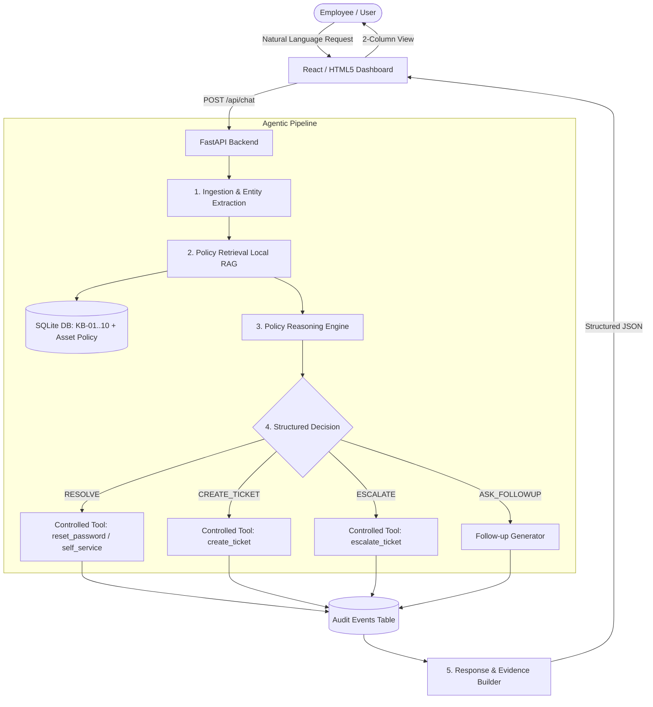
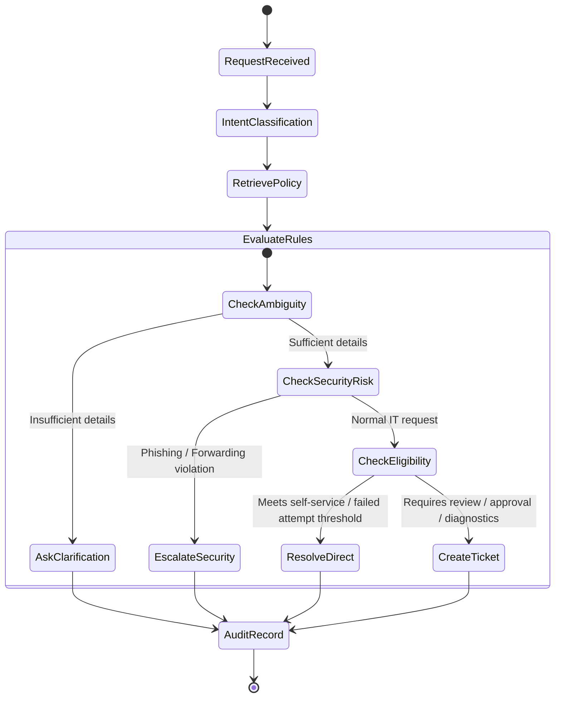

# Veridian IT Agent — System Architecture

## 1. High-Level Architecture

The **Veridian IT Agent** is an autonomous, policy-aware internal service copilot designed to handle employee IT requests with 100% adherence to company policies and zero hallucination.

---

## 2. Decision & Escalation Flow

---

## 3. Data Flow & Security Guardrails

1. **Strict Local RAG**:
   The agent queries SQLite exclusively for policies grounded in the Veridian Corp Data Pack (KB-01 through KB-10 and Finance Asset Management Policy Extract). No external search or ungrounded policies are allowed.
2. **Controlled Tools**:
   The LLM / Agent cannot execute arbitrary code, raw SQL, shell commands, or network calls. It emits a typed `StructuredDecision`, and backend Python handlers validate and execute strictly whitelisted tools (`reset_password`, `create_ticket`, `escalate_ticket`).
3. **Immutable Audit Trail**:
   Every stage (`INGESTION`, `RETRIEVAL`, `REASONING`, `EXECUTION`, `COMPLETION`) writes an immutable record to the `audit_events` table in SQLite.
